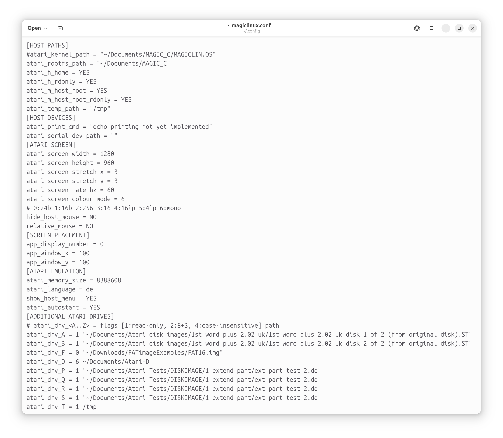

# MagicOnLinuX

An Atari ST/TT High Level Emulator for Linux, SDL2 based, running MagiC OS only.

This is kind of successor of:

* *KAOS 1.2* for Atari,
* *KAOS 1.4.2* for Atari,
* *MagiC* for Atari,
* *MagicMac* for Classic Mac OS (68k and PPC),
* *MagicMac X* for MacOS X on PPC (32-bit application) and
* *AtariX* for macOS up to 10.13 "High Sierra" (32-bit application).

Basically MagicOnLinux is an extended and improved AtariX with removed GUI and replaced host file system; in particular the Carbon based MacXFS was replaced with a Linux/Posix based host XFS. Additionally, due to the 64-bit host architecture, any callback from emulated to emulator had to be replaced with a new, different concept.

Additionally to AtariX and its predecessors, MagicOnLinux has limited hardware emulation, mainly for video registers, for higher compatibility, basic sound for key click and bell, and network support.

# How to Build and Install on Linux (new method, untested)

(This is the new method, yet untested. Use method below if it does not work!)

- git clone https://gitlab.com/AndreasK/magiclinux
- cd magiclinux

Optionally edit "install-all.sh".
Optionaly edit install-rootfs.sh to change rootfs path or initial Atari language.
Optionally adapt some default values in "CMakeLists.txt", e.g. set CMAKE_BUILD_TYPE to "Debug"

Then:

- ./install-all.sh

This should build the emulator program, install it and also register the respective file types and icons.
Finally the Atari root filesystem (C:) is created, populated and configured for your default language.

Alternative root filesystems can be found here: https://tho-otto.de/snapshots/magicmac/.
Make sure that the MAGICLIN.OS files match!

# How to Build and Install on macOS

- git clone https://gitlab.com/AndreasK/magiclinux
- cd magiclinux

Optionaly edit install-rootfs.sh to change rootfs path or initial Atari language.

- Follow the instructions in MACOS.txt.
- ./install_rootfs.sh

# Old Method: How To Build (Linux, tested with Ubuntu 24.04)

- sudo apt install libsdl2-dev libsdl2-mixer-dev gxmessage
- cd ~/Documents
- git clone https://gitlab.com/AndreasK/magiclinux
- git clone https://gitlab.com/AndreasK/AtariX
- mkdir magiclinux/build
- pushd magiclinux/build
- cmake -DCMAKE_BUILD_TYPE=Release ..
- make
- popd
- cp -rp AtariX/src/AtariX-MT/AtariX/rootfs-common Atari-rootfs
- rm Atari-rootfs/GEMSYS/MFM16M-1fff.SYS
- rm -rf Atari-rootfs/GEMSYS/OLD
- mv Atari-rootfs/GEMSYS/NEU/OFF16MOV.OSD Atari-rootfs/GEMSYS/
- rmdir Atari-rootfs/GEMSYS/NEU
- mkdir Atari-rootfs/GEMSYS/GEMSCRAP
- mkdir Atari-rootfs/LANG Atari-rootfs/LANG/DE Atari-rootfs/LANG/EN Atari-rootfs/LANG/FR
- rsync -a AtariX/src/AtariX-MT/AtariX/English.lproj/rootfs/ Atari-rootfs/LANG/EN/
- rsync -a AtariX/src/AtariX-MT/AtariX/de.lproj/rootfs/ Atari-rootfs/LANG/DE/
- rsync -a AtariX/src/AtariX-MT/AtariX/fr.lproj/rootfs/ Atari-rootfs/LANG/FR/
- cp -p magiclinux/kernel/VDI/DRIVERS/MAC/SRC/MFM4IP.SYS Atari-rootfs/GEMSYS/
- cp -p magiclinux/kernel/BUILD/EN/MAGICLIN.OS Atari-rootfs/LANG/EN/
- cp -p magiclinux/kernel/BUILD/DE/MAGICLIN.OS Atari-rootfs/LANG/DE/
- cp -p magiclinux/kernel/BUILD/FR/MAGICLIN.OS Atari-rootfs/LANG/FR/
- cp -p magiclinux/kernel/LOCALISE.SH Atari-rootfs/LANG/
- cp -p magiclinux/rootfs/LANG/DE/GEMSYS/GEMDESK/MAGXDESK.RSC Atari-rootfs/LANG/DE/GEMSYS/GEMDESK/
- cp -p magiclinux/rootfs/LANG/EN/GEMSYS/GEMDESK/MAGXDESK.RSC Atari-rootfs/LANG/EN/GEMSYS/GEMDESK/
- cp -p magiclinux/rootfs/LANG/FR/GEMSYS/GEMDESK/MAGXDESK.RSC Atari-rootfs/LANG/FR/GEMSYS/GEMDESK/
- touch Atari-rootfs/MAGICLIN.OS
- Atari-rootfs/LANG/LOCALISE.SH EN
- mv Atari-rootfs MAGIC_C

Replace "LOCALISE.SH EN" with "LOCALISE.SH DE" or "LOCALISE.SH FR" for German or French as initial language. However, the Atari's language can be changed later via config file or command line.

If you like, add cmake parameter -DCMAKE_INSTALL_PREFIX:PATH=/opt for changing the installation directory tree from "/usr/local" to "/opt". Note that installation is an additional, optional, but recommended step, see below.

Optionally adapt some default values in "CMakeLists.txt".

Without gxmessage you will not see error message dialogues, instead the text will be printed to stderr only.

You might replace CMAKE_BUILD_TYPE with "Debug" (to get debug log output) or omit this parameter.

Alternatively you can put your Atari root file system (drive C:) and kernel (MAGICLIN.OS) anywhere and configure the emulator accordingly.

# How To Run

If properly installed, start the program magic-on-linux from command line, from your application manager or via an Atari program or ".st" floppy disk image, with double click or "open with...". Otherwise you can find the executable under build/magic-on-linux.

Try to e.g. add command line parameter "--atari-screen-mode=st-high" for misbehaving programs.

Use parameter "-h" or "--help" for an explanation of the parameters.

Especially helpful: parameter "-e" to open the configuration file in a text editor.

The Atari's language can be changed anytime, via command line (-lang=de) or in the config file. If necessary, some localised files are then copied inside root file system.

Atari RAM size is given in bytes and excludes video memory, which is managed separately.

Source files for the Atari code (MagiC kernel and applications) are also available in their respective repository, see below.

# Uninstall Application

For Linux, run:

- sudo ./uninstall.sh

to unregister the application, its icons and MIME types.
To also remove the configuration file, root filesystem and the application itself:

- rm ~/.config/magiclinux.conf
- rm -rf ~/Documents/MAGIC_C
- rm -rf build/*

# Screenshots

# Supported

* Emulates MC68020 processor
* Arbitrary screen sizes and colour depths
* Zoom, helpful for original 640x400 or 640x200 resolution
* Basic, limited hardware emulation for video registers
* Basic sound, key click and bell only.
* Full access to host file system, up to root
* Mounts Atari volume or floppy disk images and primary partions of MBR partitioned disk images.
* Mount file systems, folder or image, via Drag&Drop, readable or read-only.
* Copy/paste clipboard text between host and emulated system.
* Command line option to convert Atari text files to UTF-8 and vice-versa, including line endings between CR/LF and LF.
* Some command line switches are provided to override config file settings.

# Remarks

* The MagiC task manager is activated via Ctrl-Alt-^ (the key below Esc) on German keyboards, because Ctrl-Alt-Esc is reserved in Linux.
* Alternatively use Cmd-Ctrl-Alt-Esc (Cmd is the "Windows" key).
* The MagiC application switcher is activated with Cmd-Alt-Ctrl-Tab.
* MagiC warmboot/coldboot are activated with Cmd-Alt-Ctrl-Del resp. Cmd-Alt-Ctrl-ShiftR-Del (causing end of emulation).
* To mount disk image partitions via configuration file, specify the same disk image file multiple times.

# Bugs and Agenda

* 68882 FPU emulation should be added, i.e. the line-F-opcodes should work.
* Musashi emulator sources might be synchronised with latest version (see below).

# Example Command to Create a Volume Image:

* "-S 512" for 512 bytes per sector
* "-s 2" for 2 sectors per cluster
* "-F 32" for FAT32, FAT16 and FAT12
* Specify "-v" for verbose output
* Name written to boot sector is "FAT32_1M"
* Filename is "vol-fat32-1M.img"
* Volume size is 1024 kB (1 MB)

mkfs.vfat -S 512 -s 2 -F 32 -v -n "FAT32_1M" -C vol-fat32-1M.img 1024

# Example Command to Create a 720k Floppy Disk Image

mkfs.msdos -C floppy720k.img 720

# License

The MagicOnLinux emulator is licensed according to GPLv3, see LICENSE file.

# External Licenses

**AtariX application for older macOS, multilingual root FS and sources**
see: https://gitlab.com/AndreasK/AtariX

**Atari Sources**
see: https://gitlab.com/AndreasK/Atari-Mac-MagiC-Sources

**Musashi 68k emulator in C**
Copyright 1998-2002 Karl Stenerud
Source: https://github.com/kstenerud/Musashi
License: https://github.com/kstenerud/Musashi/readme.txt

**SDL library:**
Source: https://www.libsdl.org
Copyright: paultaylor@jthink.net
License: http://www.gzip.org/zlib/zlib_license.html

**Atari VDI Drivers**
Copyright: Wilfried und Sven Behne, License: mit freundlicher Genehmigung

**Klick**
https://freesound.org/people/BryanSaraiva/sounds/820351/

**Ding**
https://freesound.org/people/datasoundsample/sounds/638638/

**Atari MIME program icon**
https://www.pngegg.com/en/png-mlumk
